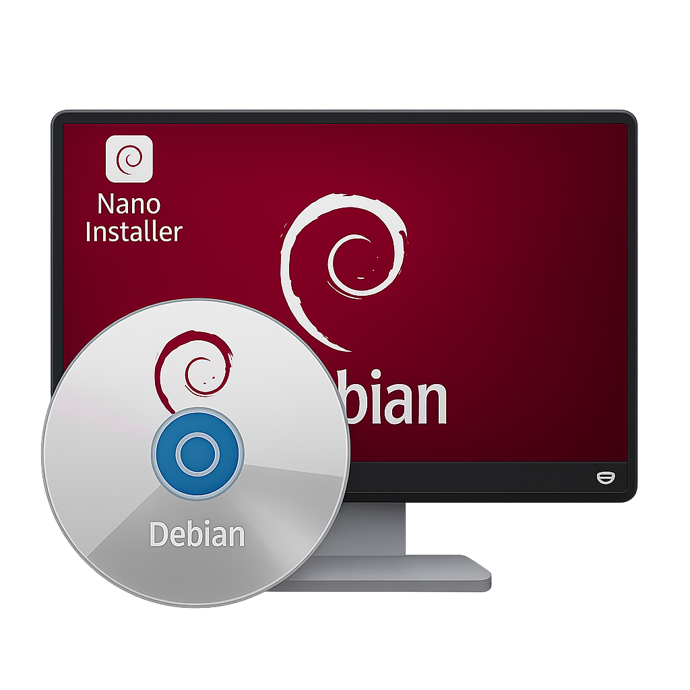

# Nano-deb-Installer

Copyright (c) 2025 putinservai-cyber. All rights reserved. Unauthorized reuse or re-uploading of this project's code is prohibited.

The Nano Installer provides a secure and feature-rich graphical interface for installing, updating, and managing local Debian packages (.deb files). It includes features like security scanning and dependency management.

## Features:
*   **Secure Package Installation:** Safely install .deb packages with integrated security checks.
*   **Dependency Management:** Automatically identifies and helps resolve missing package dependencies.
*   **Graphical User Interface (GUI):** An intuitive and easy-to-use interface for all operations.
*   **Package Updates:** Keep your installed Debian packages up-to-date.
*   **Local Package Management:** Manage your local .deb files efficiently.

## Installation

To install the application, download the latest `.deb` package from the GitHub releases page and use `dpkg` to install it.

1.  **Download the Package:**
    Download the latest `nano-installer_<version>_<arch>.deb` file from the releases section of this repository.

2.  **Install the Package:**
    Install the downloaded `.deb` file using `dpkg`. Replace `nano-installer_<version>_<arch>.deb` with the actual filename.

    ```bash
    sudo dpkg -i nano-installer_<version>_<arch>.deb
    sudo apt install -f # To fix any missing dependencies